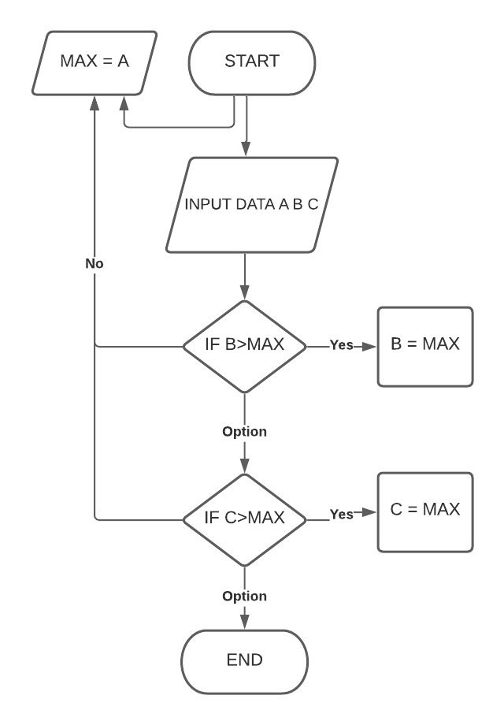
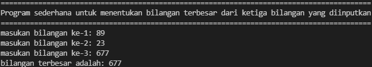

# Praktikum3
## Tugas Pertemuan 7 - Bahasa Pemrograman

### 1. Labspy02(Tugas praktikum 2)
**Program sederhana untuk menentukan bilangan terbesar dari tiga buah bilangan yang diinputkan**

* **CODINGAN:**
```
 def main():
    # membuat judul program
    print("="*89)
    print("Program sederhana untuk menentukan bilangan terbesar dari tiga buah bilangan yang diinputkan")
    print("="*89)
    # input dari user
    a = int(input('masukan bilangan ke-1: '))
    b = int(input('masukan bilangan ke-2: '))
    c = int(input('masukan bilangan ke-3: '))
 
    # menentukan nilai bilangan
    maks = a
    if b > maks:
        maks = b
    if c > maks:
        maks = c
 
    # cetak hasil
    print('bilangan terbesar adalah: %d' % maks)
 
 if __name__=='__main__':
    main()
```
Berikut adalah flowchart program:



* **Hasil output program:**

