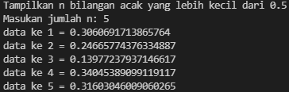
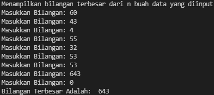
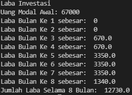

# Praktikum3
## Tugas Pertemuan 7 - Bahasa Pemrograman

### 1. File latihan1.py
**Program sederhana untuk menentukan bilangan terbesar dari dua bilangan yang diinputkan**

* **CODINGAN:**
```
 print("Tampilkan n bilangan acak yang lebih kecil dari 0.5")

 jumlah = int(input("Masukan jumlah n: "))
 import random
 for i in range(jumlah):
     print("data ke", i+1,"=",(random.uniform(0.1,0.5)))
```

* **Penjelasan alur program:**
```
   -print("Menampilkan n bilangan acak yang lebih kecil dari 0.5") 
   itu merupakan perintah untuk menampilkan sebuah input dari judul program
   -jumlah = int(input("Masukan jumlah n: )) 
   Adalah perinntah untuk menginputkan nilai n tersebut
   -import random
   Adalah perintah untuk menginportkan built-in random yang telah tersedia di python
   -for in range (jumlah): 
   Adalah perintah untuk, i sebagai integer dalam baris jumlah
   -print ("data ke",i+1,"=",(random.uniform(0.1,0.5))) 
   Adalah perintah untuk menampilkan hasil yang telah di input dengan ketentuan random uniform mulai dari nilai 0.1 sampai 0.5
```

* **Hasil output program:**



### 2. File latihan2.py
**Program sederhana untuk menampilkan bilangan terbesar dari n buah data yang diinputkan**

* **CODINGAN:**
```
 print("Menampilkan bilangan terbesar dari n buah data yang diinput")

 max = 0
 while True:
     a = int(input("Masukkan Bilangan: "))
     if max < a:
         max = a
     if a ==0:
         break
 print("Bilangan Terbesar Adalah: ", max)
 ```

 * **Penjelasan alur program:**
```
   -print("Menampilkan bilangan terbesar dari n buah data yang diinput") 
   itu merupakan perintah untuk menampilkan sebuah input dari judul program
   -a = int(input("Masukkan Bilangan: "))
   Adalah perinntah untuk menginputkan bilangan
   -if max < a:
         max = a
   ini adalah  max kurang dari nilai a, maka max sama dengan a
   -if a ==0:
         break 
   Adalah perintah untuk berhenti dari program yang sedang berjalan, dengaan mengetik angka 0
   -print("Bilangan Terbesar Adalah: ", max)
   Adalah perintah untuk menampilkan hasil yang terbesar dari sebuah bilangan yang diinputkan
```

* **Hasil output program:**



### 3. File program1.py
**Program sederhana untuk menampilkan bilangan terbesar dari n buah data yang diinputkan**

* **CODINGAN:**
```
 print("Laba Investasi")

 x = int(input("Uang Modal Awal: "))

 a = 0*x
 b = 0*x
 c = 0.01*x
 d = 0.01*x
 e = 0.05*x
 f = 0.05*x
 g = 0.05*x
 h = 0.02*x
 y=[a,b,c,d,e,f,g,h]

 for i in range(len(y)):
     print("Laba Bulan Ke",i+1 ,"sebesar: ",y[i])

 z=(a+b+c+d+e+f+g+h)
 print("Jumlah Laba Selama 8 Bulan: ",z)
 ```

 * **Penjelasan alur program:**
```
 - inout nilai a
 - gunakan for untuk perulangan dari 1 sampai 8.Perulangan for disebut counted loop (perulangan yang terhitung)
 - lalu gunakan if pertama untuk menentukan laba bulan ke 1 dan ke 2.masukan variabel (b) kalikan nilai (a) dengan data bulan 1 dan 2. cetak (x) dan (b)
 - lalu gunakan if kedua untuk menentukan laba bulan ke 3 dan ke 4.masukan variabel (b) kalikan nilai (a) dengan data bulan 3 dan 4. cetak (x) dan (c)
 - lalu gunakan if ketiga untuk menentukan laba bulan ke 5 sampai ke 7.masukan variabel (b) kalikan nilai (a) dengan data bulan 5 sampai 7. cetak (x) dan (d)
 - lalu gunakan if keempat untuk menentukan laba bulan ke 8.masukan variabel (b) kalikan nilai (a) dengan data bulan 8. cetak (x) dan (e)
 - lalu total keseluruhan.
 - cetak total
```

* **Hasil output program:**

