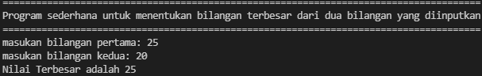
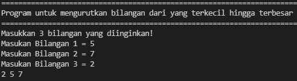
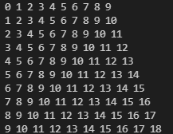
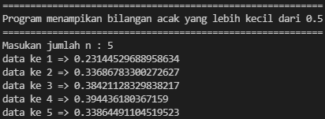

# Tugas praktikum 2
## Tugas Pertemuan 7 - Bahasa Pemrograman

### 1. File program latihan1 (Lab 2 Struktur kondisi)
**Program sederhana untuk menentukan bilangan terbesar dari dua bilangan yang diinputkan**

* **CODINGAN:**
```
 def main():
    # membuat judul program
    print("="*86)
    print('Program sederhana untuk menentukan bilangan terbesar dari dua bilangan yang diinputkan')
    print("="*86)
    # menentukan input user
    a = int(input("masukan bilangan pertama: "))
    b = int(input("masukan bilangan kedua: "))
 
     # Menentukan Nilai Bilangan  dengan if else
    if a > b:
        maks = a
    else:
        maks = b
    # mencetak nilai maksimum
    print('Nilai Terbesar adalah %d' % maks)
 
 if __name__ == '__main__':
    main()
```

* **Hasil output program:**



### 2. File program latihan2 (Lab 2 Struktur kondisi)
**Program untuk mengurutkan bilangan dari yang terkecil hingga terbesar**

* **CODINGAN:**
```
 #Judul Program
 print('='*70)
 print ('Program untuk mengurutkan bilangan dari yang terkecil hingga terbesar')
 print('='*70)

 #Input 
 def pengulangan():
     print ('Masukkan 3 bilangan yang diinginkan!')
     a=int(input('Masukan Bilangan 1 = '))
     b=int(input('Masukan Bilangan 2 = '))
     c=int(input('Masukan Bilangan 3 = '))

 #Kondisi
     if a<b and a<c:
         if b<c:
            
 #Output 
             print(a, b, c)
         else:
             print(a, c, b)
     elif b<a and b<c:
         if a<c:
             print(b, a, c)
         else:
             print(b, c, a)
     else:
         if a<b:
             print(c, a, b)
         else:
             print(c, b, a)

     print('')
     print('Ingin mencoba lagi? (ya/tidak)')
     x=input()
     if x=='ya':
         return pengulangan()
     if x=='tidak':
         print('='*45)
         print('Terima kasih telah menggunakan program ini :)')
         print('='*45)
 pengulangan()
```

* **Hasil output program:**



### 3. File program latihan 1 (Lab 3 Perulangan)
**Program dengan perulangan bertingkat (nested) for**

* **CODINGAN:**
```
for a in range(0,10):
	for b in range(0,10):
            print(a+b, end=" ")
	print()
```

* **Hasil output program:**



### 4. File program latihan 2 (Lab 3 Perulangan)
**Program untuk menampikan bilangan acak yang lebih kecil dari 0.5**

* **CODINGAN:**
```
 print("="*58)
 print("Program menampikan bilangan acak yang lebih kecil dari 0.5")
 print("="*58)
 jumlah = int(input("Masukan jumlah n : "))
 import random
 for i in range(jumlah):
    print("data ke",i+1,"=>",(random.uniform(0.1,0.5)))
```    

* **Hasil output program:**


